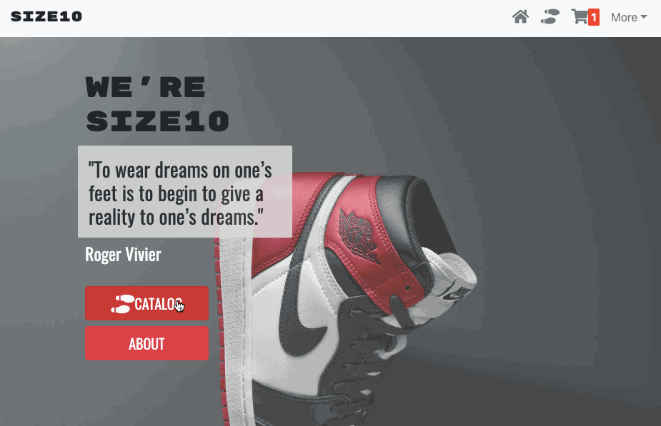

# size10 👟

<hr/>

size10 is a full-stack, demo E-Commerce store that carries shoes that are size 10. The app provides users with the ability to add shoes to their cart from a local catalog, update the quantity of shoes from the cart, and delete specific shoes from the cart.
## Getting Started
### Initial Setup
1. Fork this repo and clone your fork from the terminal.
```
$ git clone https://github.com/[user_name]/size10.git
```
2. Navigate into the cloned directory and install the necessary dependencies.
```
$ npm install
```
3. Start a dev environment with access to Apache and MySQL and:
    * Check that port is directed to ```3000```
    * Create a database titled ```size10``` in phpMyAdmin and import the ```size10.sql``` file
    * Check that the root directory of the server is set to the ```public``` folder
4. Initiate the dev server
```
$ npm run dev
```
5. Go to ```localhost:3000``` and enjoy 😃

## Built With
* Front-End
  * [JavaScript](https://www.ecma-international.org/publications/standards/Ecma-262.htm)
  * [React.js](https://reactjs.org/)
  * [Reactstrap](https://reactstrap.github.io): for desktop and mobile responsiveness
* Back-End
  * [PHP](https://php.net/)
  * [MySQL](https://www.mysql.com/) + [phpMyAdmin](https://www.phpmyadmin.net/)

## License
[MIT License](https://opensource.org/licenses/mit-license.php)

[](https://opensource.org/licenses/mit-license.php)